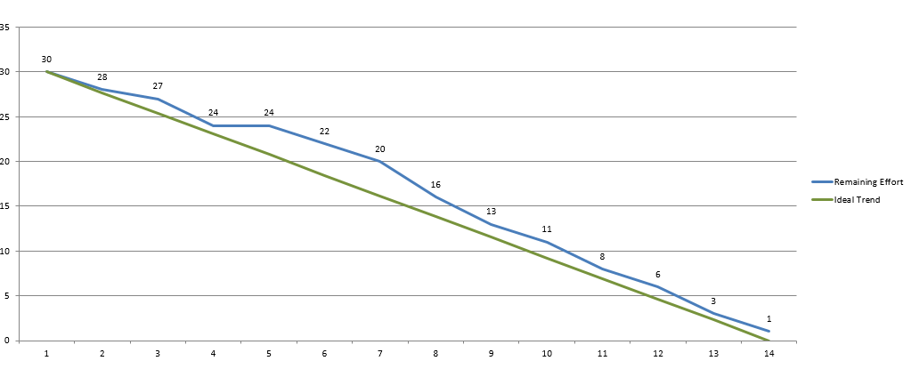

**Team 8 Workspace**

**Project 4 update:**
- New shapes added as per requirement
- Connection rules established
- Compile functionality implemented
- Double-click feature implemented **(double-click on the dot to get the textbox)**

**Burndown for Project 4:**

Required: JDK 1.8 version installed.

**How to run:**
- Import project folder Team_08 in your IDE.
- Run SourcePanel.java
